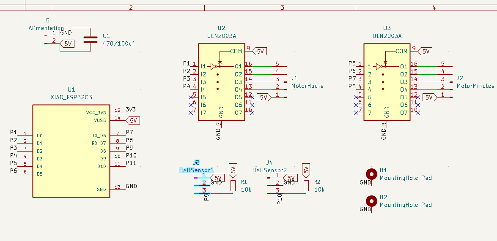
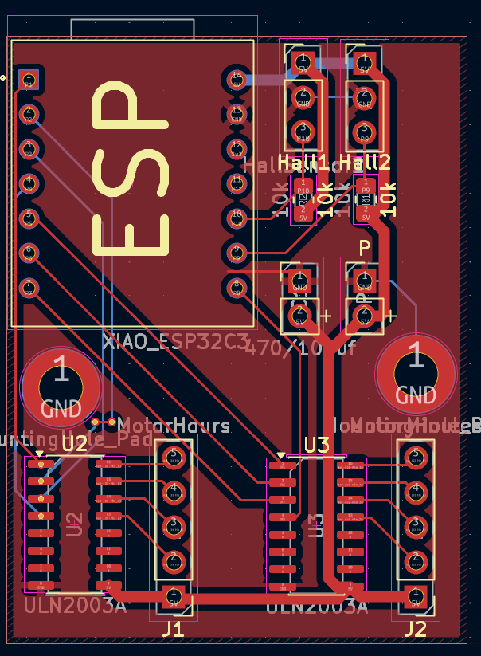
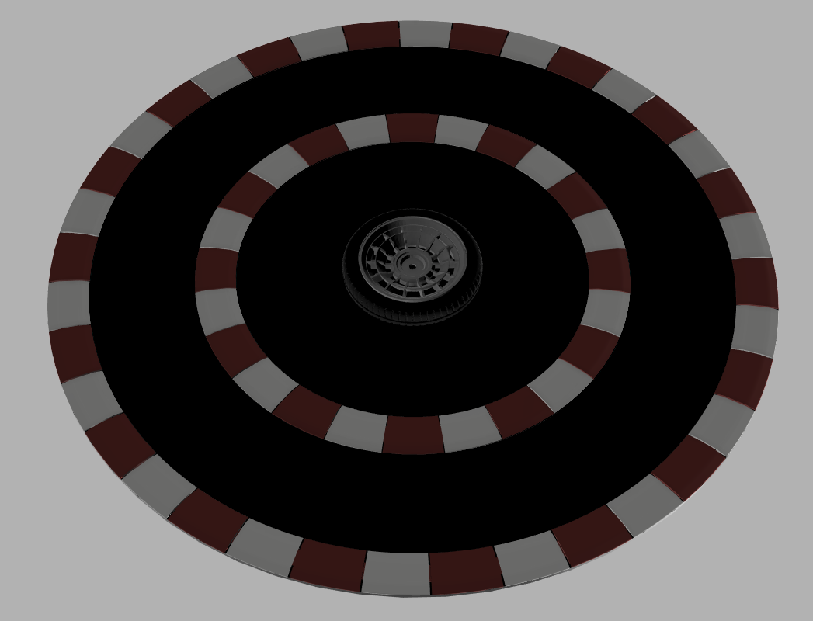
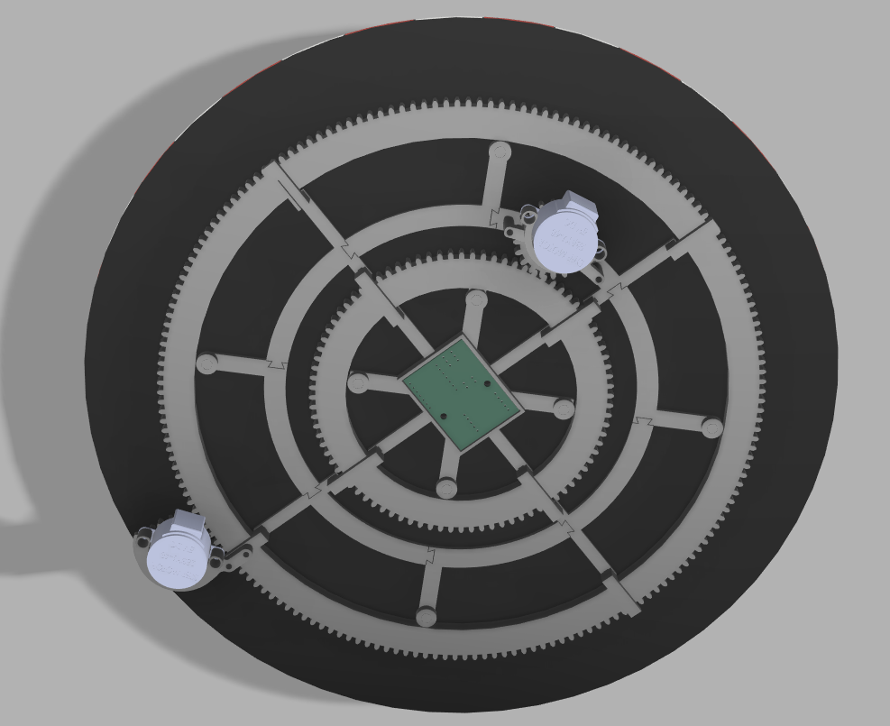

# HotWheels Clock
A wall clock that uses two hotwheels to idicate the time, the cars will be moved by two magnets behind the main board of the clock moved by two geared wheels with motors, all powered froma a 10000mAh battery and controlled by an esp32 in order to calibrate the time automatically via internet.

Wiring Schematic:

PCB:

CAD model: 

